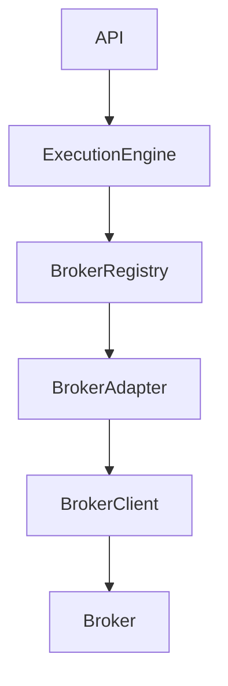
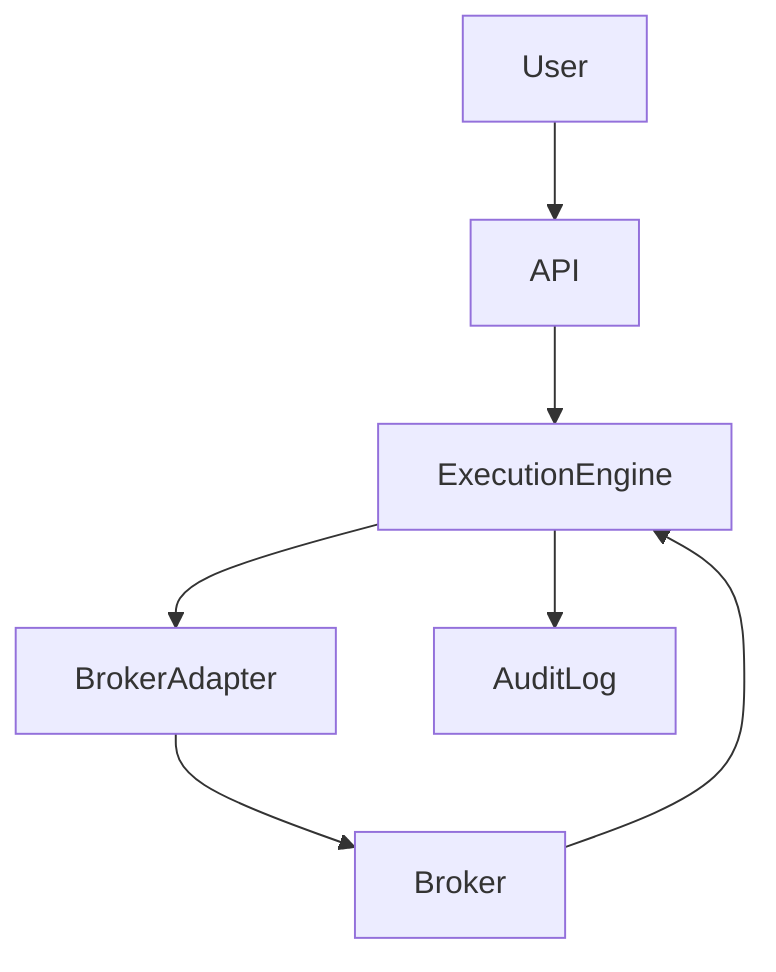
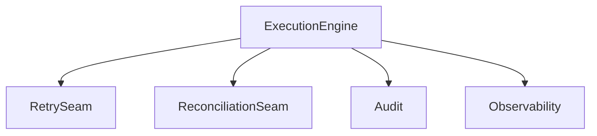
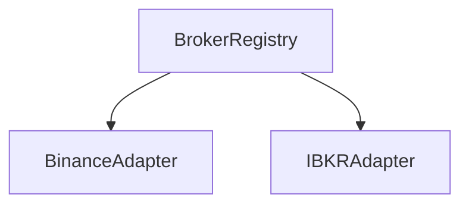
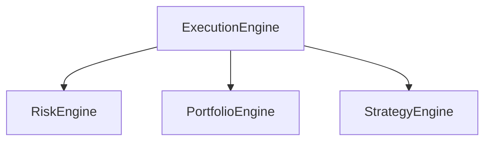
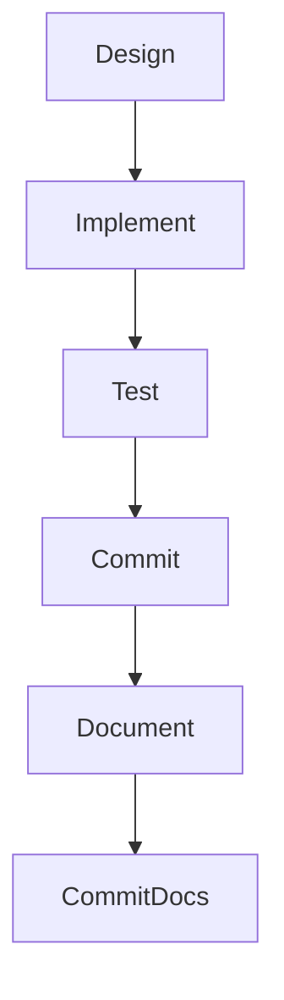

# Architecture Diagrams

## Current Architecture Diagram

## Order Lifecycle Diagram

## Execution Engine Internal Diagram

## Broker Support Diagram

## Future System Evolution Diagram

## Development-Flow Diagram

