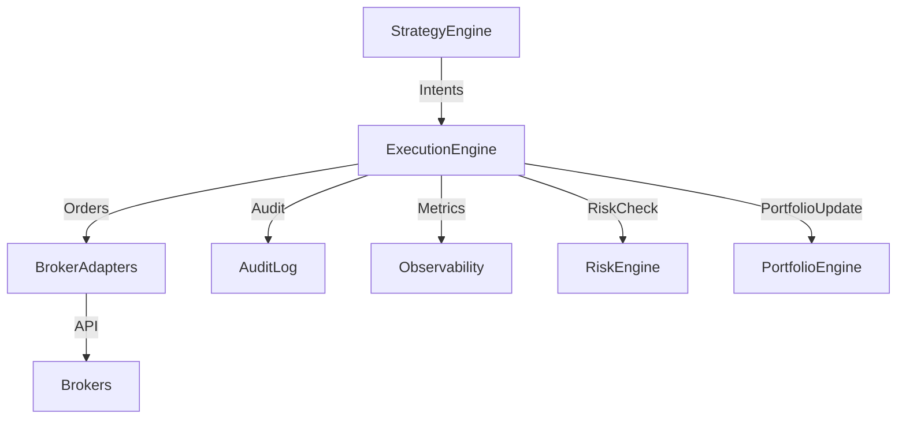

# Final Architecture Overview

## One-Page Architecture Overview
The platform integrates execution, risk, portfolio, and strategy engines in a modular, auditable, and extensible design.

## Platform Mermaid Diagrams

## Final Flow Summaries
- Orders flow from strategy to execution, through risk and portfolio checks, to broker adapters.
- All actions are audited and observable.

## Official Development Flow
1. Design the change
2. Implement code
3. Update/create tests
4. Commit the functional change
5. Update documentation if needed
6. Commit documentation separately
